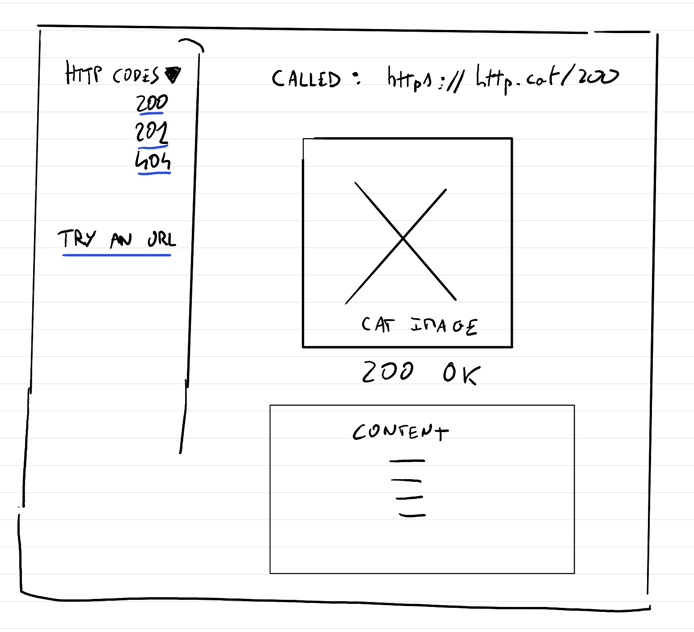

# Project introduction

## Overview

The app is an educative app to learn http codes. There is two sections : 
* http code list
* try an url

No data persistence, no user authentication. No logs.

### http code list

Allow the user to choose an http code amongs all existing and see information related. 
It use http.cat to illustrate the response and mdn web docs for the content.


### try an url

Allow the user to defined an http call. With all the options possible, and test it in the navigator.

## Architecture

The project use AWS on the eu-west-1 region.

### Frontend

The frontend app is deployed on an s3 bucket. The app is distributed via an cloudfront distribution.




### backend

The backend is served by two lambda function exposed via a REST API Gateway: 
* http_code_info
* http_execute_call

#### http_code_info

The API Gatewatay accept these parameters: 
* GET
* /http_code_info/{http_code}

The lambda fetch in asynch this url: 
* https://developer.mozilla.org/en-US/docs/Web/HTTP/Reference/Status/{http_code}
and extract the content under `<div class="section-content">`. The content is sanitized by the lambda.

The lambda output two fields in a JSON: 
* content
* image: an image to https://http.cat/images/{code}.jpg

#### http_execute_call

the lamda requires this fields: 

```
    // Required fields
    Method      string            `json:"method"`      // HTTP method (GET, POST, PUT, DELETE, etc.)
    Endpoint    string            `json:"endpoint"`    // API endpoint URL or path

    // Optional fields
    Headers     map[string]string `json:"headers,omitempty"`     // HTTP headers
    QueryParams map[string]string `json:"queryParams,omitempty"` // URL query parameters
    Body        string            `json:"body,omitempty"`        // Request body (for POST, PUT, etc.)
    Timeout     int               `json:"timeout,omitempty"`     // Request timeout in seconds
```

It will perform one call without any retry and output http response code, header and body. If there is an error (timeout etc.), respond in a specific field, with a code describing the error. 

#### API Gateway

The API gateway provide two endpoint to the two lambdas. The two endpoints require an access key.

A usage plan is defined, allowing 10 rqs and 1000 request per day. An access key is generated, associated to this usage plan


